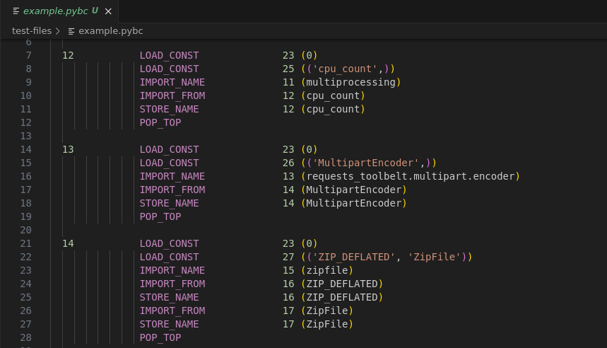

# Python Bytecode highlighter for VS Code

Make your reverse-enineering life a tiny bit more colorful: highlight disassembled .pyc files.

This project implements a very simple grammar to highlight Python Bytecode.

To use, open a file with ".pybc" extension or pick the "Python Bytecode" language manually.

### Installation

1. Clone this repository
2. Ctrl+Shift+P, "Developer: Install extension from location"

### Hacking

You can also use this project as a base for your own grammars. Just clone this repository, change the language name, extension, and the syntax file.

**Edit** this project was extended slightly, and currently there is also a support for ctrl+clicking to navigate to definition. For example, 
clicking on `<code object Settings at 0x23ca1650, file "<x>", line 23>` will navigate to a line with disassembly of that object (if found).
This is implemented in `extension.js` and is completely optional - syntax highlighting doesn't depend on it.
